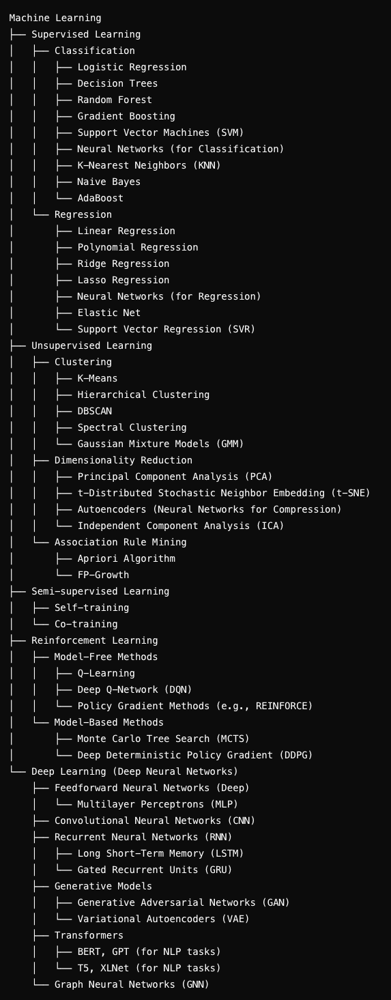

# Machine Learning

## Types

- Supervised Learning
  - Classification
  - Regression

- Unsupervised learning
  - Clustering
  - Dimensionality Reduction
  - Associate Rule Mining

- Reinforcement Learning
  - Model Based
  - Model Free

## Supervised Learning

ip-> algorithm <-op

## unsupervised Learning

ip -> algorithm -> structure

## Reinforcement Learning

Based on Positive and Negative feedback

## LSTM - Long Short-Term Memory

---

## Neural Network

ip layer -> hidden layer -> output layer
